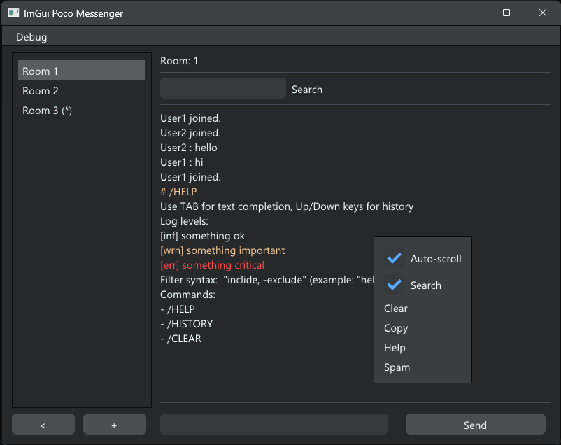

# ImGui Poco Messenger

This is an example of a simple messenger in C++ using the `ImGUI` library for UI and `Poco` for networking.

There are two rendering options available: DirectX 12 or OpenGL 3.

The project implements a flexible UI window manager, as well as a communication protocol between the client and the server, which is easy to expand. The protocol is made simple and readable for debugging. For the production version, it needs to be made more efficient and secure.

Implemented a custom application theme.

## Build

To build the client, use the `Client_DX12` or `Client_glfw_opengl3` project.

The project with the server is located in the `Server` folder.

## Dependencies

* Dear ImGui
* GLFW
* OpenGL 3
* DirectX 12

All required dependencies are located in the `Lib` folder.